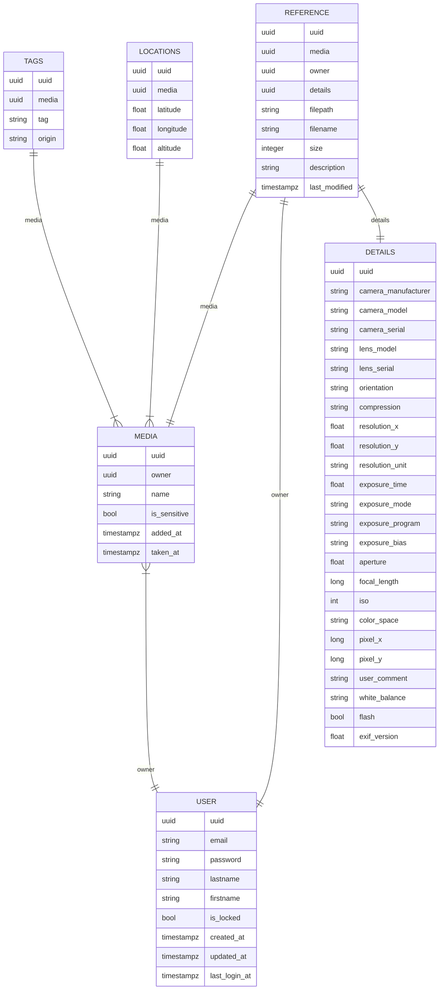

# Persistency

Files are just written in the *data/files/* directory. 

```shell
data/
└── files/
    └── A1B2C3D4-E5F6-A1B2-C3D4-A1B2C3D4E5F6
        └── 2023
            ├── DSC_1234.xmp
            ├── DSC_1234.jpg
            ├── DSC_1234.NEW
            ├── DSC_1234.dng
            └── DSC_1234_overlay.jpg
```

Metadata are saved in a relational like **SQLite** or **PostgreSQL** and split into several tables.



These data are merged in regarding repositories.
